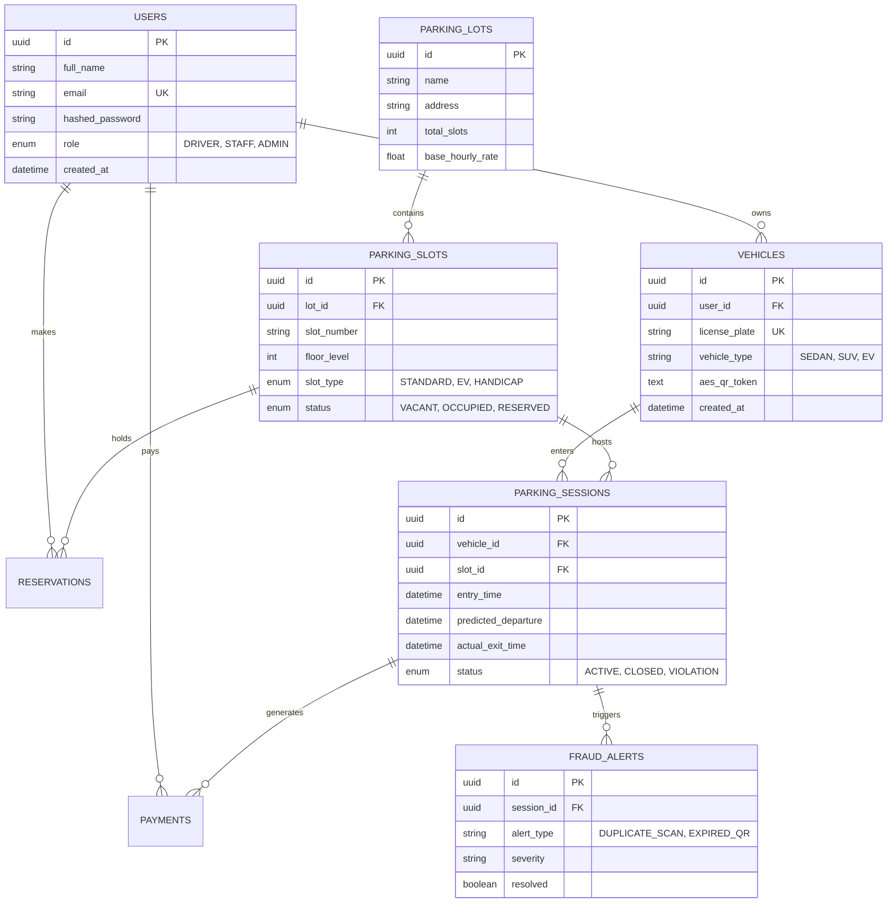

# Enterprise Architecture & SRS Blueprint: ParkIQ Smart Parking Intelligence Platform

**ParkIQ** is an enterprise-level, AI-powered Smart Parking Intelligence Platform designed with Google-level engineering standards. It unifies AES-256-GCM encrypted dynamic QR identities, AI predictive analytics, Retrieval-Augmented Generation (RAG), real-time event streaming, and cloud-native microservices.

> [!IMPORTANT]
> **No code will be executed or generated until you approve this complete Architectural Specification.**

---

## 1. Functional Requirements (FR)

### 1.1 Driver Ecosystem
- **FR-DR-01 (Dynamic AES-256 QR Identity)**: System automatically generates a rolling AES-256-GCM encrypted QR code token for each registered vehicle. The QR token exposes zero PII (Owner name, phone, full license plate, payment info).
- **FR-DR-02 (Parking Session & Duration Tracking)**: Drivers specify an expected parking duration (e.g., 1 hour) upon entry. The system tracks remaining duration in real-time.
- **FR-DR-03 (AI Departure & Expiration Alerts)**: When remaining parking duration falls below 20 minutes (or dynamically predicted threshold), system dispatches intelligent FCM push notifications and SMS reminders to the vehicle owner.
- **FR-DR-04 (Public Privacy Scan View)**: When an unauthenticated third party scans a parked vehicle's QR code, the system decrypts the token on the backend and displays ONLY anonymized status (*"Parking Active"*, *"Estimated Departure: Leaving in ~20 minutes"*, *"Spot Available Soon"*), concealing owner details.
- **FR-DR-05 (Slot Discovery & Reservation)**: Real-time map navigation, slot availability filtering (EV, Handicap, Standard), and pre-booking checkout.

### 1.2 Facility Manager & Admin Ecosystem
- **FR-AD-01 (Live Telemetry Grid Map)**: Interactive dashboard showing real-time slot statuses (`VACANT`, `OCCUPIED`, `RESERVED`, `OUT_OF_SERVICE`, `EV_CHARGING`).
- **FR-AD-02 (AI Predictive Analytics)**: Dynamic occupancy fill-rate forecasting (+1 to +24 hours), peak congestion modeling, and automated surge pricing optimization.
- **FR-AD-03 (QR Cloning & Anomaly Detection)**: Algorithmic detection of duplicate QR scans, concurrent entry attempts, expired token usage, or location mismatch anomalies.
- **FR-AD-04 (Revenue & Financial Reporting)**: Real-time tracking of gross revenue, average parking duration, overstay penalty fees, and utilization rates.

### 1.3 Parking Staff & Gate Operator Ecosystem
- **FR-ST-01 (Gate Verification)**: High-speed QR scanner interface to authenticate incoming/exiting vehicles, validate active bookings, and trigger gate barriers.
- **FR-ST-02 (Manual Override & Violation Enforcement)**: Ability to reassign slots or log parking infractions for unauthorized/overstayed vehicles.

### 1.4 AI Assistant & RAG Engine
- **FR-AI-01 (RAG Conversational Assistant)**: Intelligent AI chat interface retrieving verified context from vector database (parking rules, maps, pricing, EV rules, emergency protocols, FAQs) before synthesizing response. Zero hallucination policy enforced.

---

## 2. Non-Functional Requirements (NFR)

- **NFR-SEC-01 (End-to-End Cryptography)**: QR tokens encrypted using AES-256-GCM with 96-bit random IVs and authentication tags. Database sensitive fields encrypted at rest using AES-256.
- **NFR-PERF-01 (Sub-Second Latency)**:
  - QR Code decryption & identity validation in **< 100ms**.
  - Real-time WebSocket slot state broadcast in **< 500ms**.
  - RAG Vector Search & LLM response streaming within **< 2.0 seconds**.
- **NFR-AVAIL-01 (High Availability & Fault Tolerance)**: 99.99% system availability with multi-region AWS setup, Redis caching layer, and offline edge fallback for gate scanning.
- **NFR-SCAL-01 (Massive Scalability)**: Horizontal auto-scaling container microservices capable of handling 50,000 concurrent active sessions and 5,000 QR scans/minute.

---

## 3. User Stories (Gherkin Format)

### Story 1: Public Privacy-Preserving Scan
```gherkin
Feature: Public Vehicle QR Code Scan
  As a third-party driver looking for a parking spot
  I want to scan a parked vehicle's QR code
  So that I can check when the spot will become available without seeing the owner's private information

  Scenario: Unauthenticated public scan of an active parked vehicle
    Given a vehicle "KA-01-EQ-9988" is parked with an active session expiring in 20 minutes
    When an unauthenticated user scans the AES-256 QR code on the vehicle
    Then the backend decrypts the token securely
    And returns status "Parking Active"
    And displays "Estimated Departure: ~20 minutes"
    And hides the owner's name, phone number, and exact license plate
```

### Story 2: AI Expiration Notification
```gherkin
Feature: Intelligent Parking Expiration Alert
  As a registered driver
  I want to receive an AI reminder before my parking session expires
  So that I can extend my booking or return to my vehicle on time

  Scenario: Parking duration drops below 20 minutes
    Given a driver has an active parking session with 20 minutes remaining
    When the AI Predictive Monitor evaluates remaining duration and local traffic
    Then the system dispatches an intelligent push notification "Your parking expires in 20 minutes. Tap to extend."
    And updates the public vehicle status to "Leaving Soon"
```

---

## 4. Software System Architecture

### 4.1 Microservices & Event-Driven Topology

```
┌─────────────────────────────────────────────────────────────────────────────────────────┐
│                                    CLIENT LAYERS                                        │
│  [Driver Mobile/Web App]     [Staff Scanner Web App]     [Manager Analytics Dashboard]  │
└──────────────────────────┬─────────────────┬──────────────────┬─────────────────────────┘
                           │                 │                  │
                           ▼                 ▼                  ▼
┌─────────────────────────────────────────────────────────────────────────────────────────┐
│                           API GATEWAY / KONG / NGINX PROXY                              │
│                    (TLS 1.3 Termination, Rate Limiting, JWT Auth)                       │
└──────────────────────────┬────────────────────────────────────┬─────────────────────────┘
                           │                                    │
    ┌──────────────────────┼──────────────────────┐             │ (WebSockets)
    ▼                      ▼                      ▼             ▼
┌──────────────┐    ┌──────────────┐    ┌───────────────────┐ ┌───────────────────────────┐
│ Auth Service │    │  QR Crypto   │    │ Session & Booking │ │ Real-Time Telemetry Hub   │
│ (JWT & RBAC) │    │ Engine (AES) │    │  Engine (State)   │ │  (Redis Pub/Sub + WS)     │
└──────┬───────┘    └──────┬───────┘    └─────────┬─────────┘ └─────────────┬─────────────┘
       │                   │                      │                         │
       └───────────────────┴──────────┬───────────┴─────────────────────────┘
                                      │
                                      ▼
                      ┌───────────────────────────────┐
                      │    PostgreSQL Primary DB      │
                      │  (Users, Sessions, Vehicles)  │
                      └───────────────┬───────────────┘
                                      │
       ┌──────────────────────────────┼──────────────────────────────┐
       ▼                              ▼                              ▼
┌──────────────────────────────┐ ┌───────────────────────────┐ ┌───────────────────────────┐
│   AI Analytics Microservice  │ │   RAG Knowledge Engine    │ │ Notification Worker Svc   │
│  (Scikit-Learn / PyTorch)    │ │  (ChromaDB + Gemini API)  │ │ (FCM / AWS SNS / Twilio)  │
└──────────────────────────────┘ └───────────────────────────┘ └───────────────────────────┘
```

---

## 5. Relational Database Schema & Entity-Relationship (ER) Diagram

### 5.1 ER Diagram (Mermaid)



---

## 6. AI Architecture & Predictive Pipeline

1. **Departure Time Prediction Engine**:
   - **Feature Vectors**: `[entry_hour, day_of_week, vehicle_type, user_historical_avg_duration, lot_congestion_index]`
   - **Model**: Gradient Boosted Decision Trees (XGBoost / LightGBM) trained on historical session durations.
   - **Output**: Estimated Exit Timestamp ($\hat{T}_{exit}$).
2. **Occupancy & Demand Forecasting**:
   - Time-series ARIMA / LSTM model projecting garage fill-rates 1 to 24 hours into the future.
3. **QR Anomaly & Fraud Detection Engine**:
   - Detects concurrent scans of the same vehicle token at separate physical gates within impossibly short timeframes ($\Delta t < \text{distance} / \text{max\_speed}$).
   - Identifies expired tokens or replayed payloads.

---

## 7. RAG (Retrieval-Augmented Generation) Architecture

```
[User Question] ──> [Query Embedding Model] ──> [ChromaDB Vector Index]
                                                      │
                                                      ▼ Top-k Relevant Chunks
                                            [Context Assembly]
                                                      │
                                                      ▼
                              [Google Gemini 1.5/2.0 Flash Synthesis]
                                                      │
                                                      ▼
                                       [Grounded Answer + Citations]
```

- **Chunking Strategy**: 500-character semantic sliding windows with 100-character overlaps.
- **Knowledge Sources**: Facility layout maps, parking policy PDFs, emergency protocols, EV charging rates, and pricing guidelines.
- **Guardrails**: System prompt strictly enforces grounding against retrieved vector passages. If ungrounded, returns standard ParkIQ helpdesk contact.

---

## 8. API Design Specification (RESTful Open-API)

| Endpoint | Method | Role | Description |
| :--- | :--- | :--- | :--- |
| `/api/v1/auth/register` | `POST` | Public | Register new user account |
| `/api/v1/auth/login` | `POST` | Public | Authenticate user & return JWT token |
| `/api/v1/vehicles` | `POST` | Driver | Register vehicle & generate AES-256 QR code |
| `/api/v1/qr/verify` | `POST` | Staff/Admin | Decrypt and validate vehicle QR token |
| `/api/v1/qr/public-status/{token}`| `GET` | Public | Returns non-sensitive vehicle status (Zero PII) |
| `/api/v1/sessions/check-in` | `POST` | Driver/Staff | Initiate parking session via QR scan |
| `/api/v1/sessions/check-out` | `POST` | Driver/Staff | Terminate session & calculate final fare |
| `/api/v1/ai/predict` | `POST` | Admin/Driver| Fetch AI occupancy & departure predictions |
| `/api/v1/rag/chat` | `POST` | Driver/Admin| Query AI RAG Knowledge Assistant |
| `/api/v1/analytics/dashboard` | `GET` | Admin | Fetch live revenue, occupancy grid & fraud alerts |

---

## 9. Folder Structure

```
ParkIQ/
├── backend/
│   ├── app/
│   │   ├── core/
│   │   │   ├── config.py           # Pydantic Settings
│   │   │   ├── security.py         # JWT & Password Hashing
│   │   │   └── qr_crypto.py        # AES-256-GCM Engine
│   │   ├── models/                 # SQLAlchemy Models
│   │   ├── schemas/                # Pydantic Request/Response Schemas
│   │   ├── routers/                # API Endpoints (Auth, QR, AI, RAG, etc.)
│   │   ├── services/
│   │   │   ├── ai_engine.py        # Departure & Occupancy AI Models
│   │   │   ├── rag_engine.py       # ChromaDB + Gemini RAG Engine
│   │   │   └── seed_data.py        # Database Initializer
│   │   └── main.py                 # FastAPI Main Application
│   ├── tests/                      # Pytest Automated Test Suite
│   └── Dockerfile
├── frontend/
│   ├── index.html                  # Glassmorphism Single-Page Application
│   ├── styles.css                  # Custom Dark Mode Design Tokens & CSS
│   └── app.js                      # API & QR Canvas Renderer Logic
├── docker-compose.yml              # Multi-container Orchestration
└── README.md
```

---

## 10. UML Sequence Diagram: Check-In & Public Scan

```mermaid
sequenceDiagram
    autonumber
    actor Driver
    actor PublicScanner
    participant StaffGate as Staff Scanner
    participant API as FastAPI Backend
    participant Crypto as AES-256 Engine
    participant DB as PostgreSQL
    participant AI as AI Engine

    rect rgb(18, 26, 44)
    note right of Driver: Driver Check-In & Gate Verification
    Driver->>StaffGate: Present AES-256 QR Code
    StaffGate->>API: POST /api/v1/qr/verify (token)
    API->>Crypto: Decrypt Token (AES-256-GCM)
    Crypto-->>API: Decrypted Payload {vehicle_id, owner_id}
    API->>DB: Query Vehicle & Session Status
    API->>AI: Predict Departure Time
    AI-->>API: Predicted Exit (e.g. +75 mins)
    API->>DB: Create Active Parking Session & Set Slot OCCUPIED
    API-->>StaffGate: Gate Unlocked & Entry Confirmed
    end

    rect rgb(10, 30, 50)
    note right of PublicScanner: Public Privacy Scan Flow
    PublicScanner->>API: GET /api/v1/qr/public-status/{token}
    API->>Crypto: Decrypt Token (AES-256-GCM)
    API->>DB: Fetch Active Session Status
    API-->>PublicScanner: Return Masked Status ("Parking Active", "Est Departure: 20 mins", ZERO PII)
    end
```



---

## 11. Tech Stack Matrix

- **Frontend**: Next.js 14 / HTML5 Single-Page Application, Vanilla CSS + Tailwind, Canvas QR Renderer, Leaflet Mapbox.
- **Backend Framework**: Python FastAPI (High-performance Async ASGI) + Node.js WebSockets.
- **Security & Cryptography**: PyCryptodome (AES-256-GCM), PyJWT, Passlib (Bcrypt).
- **Database & Cache**: PostgreSQL 16 (Relational DB), Redis 7 (In-Memory Cache & Pub/Sub).
- **Vector DB & AI**: ChromaDB (Vector Store), Google Gemini API (1.5/2.0 Flash), Scikit-Learn / XGBoost.
- **DevOps & Infrastructure**: Docker, Docker Compose, AWS (EC2, RDS, ElastiCache, S3, CloudWatch).

---

## 12. Deployment Plan (AWS Cloud Infrastructure)

- **Compute Layer**: AWS ECS (Elastic Container Service) running Fargate tasks for auto-scaling FastAPI containers.
- **Database Layer**: Multi-AZ AWS RDS PostgreSQL with automatic failover and read-replicas.
- **Cache Layer**: AWS ElastiCache for Redis handling WebSocket state broadcast.
- **Edge & Security**: AWS CloudFront CDN + AWS WAF (Web Application Firewall) enforcing TLS 1.3 and DDoS protection.

---

## 13. Risk Assessment & Mitigation

| Risk | Impact | Mitigation Strategy |
| :--- | :--- | :--- |
| **QR Code Tampering / Replay Attacks** | High | Include random nonces and short timestamp windows in AES-256 payload. |
| **LLM Hallucination in RAG Assistant** | Medium | Enforce strict context grounding in system prompt; fallback to human support if similarity score < threshold. |
| **Network Disruption at Gate** | High | Deploy offline gate caching service with local Redis sync. |

---

## 14. Verification & Testing Plan

### Automated Tests
- Pytest unit tests for AES-256 encryption, token tampering detection, JWT token expiration, and public privacy masking.
- API integration tests for Check-in/Check-out flows and AI forecasting endpoints.

### Manual Verification
- Verify that scanning a vehicle QR code with a mobile camera reveals zero owner PII.
- Verify real-time slot state changes on the Manager Analytics Dashboard map.
